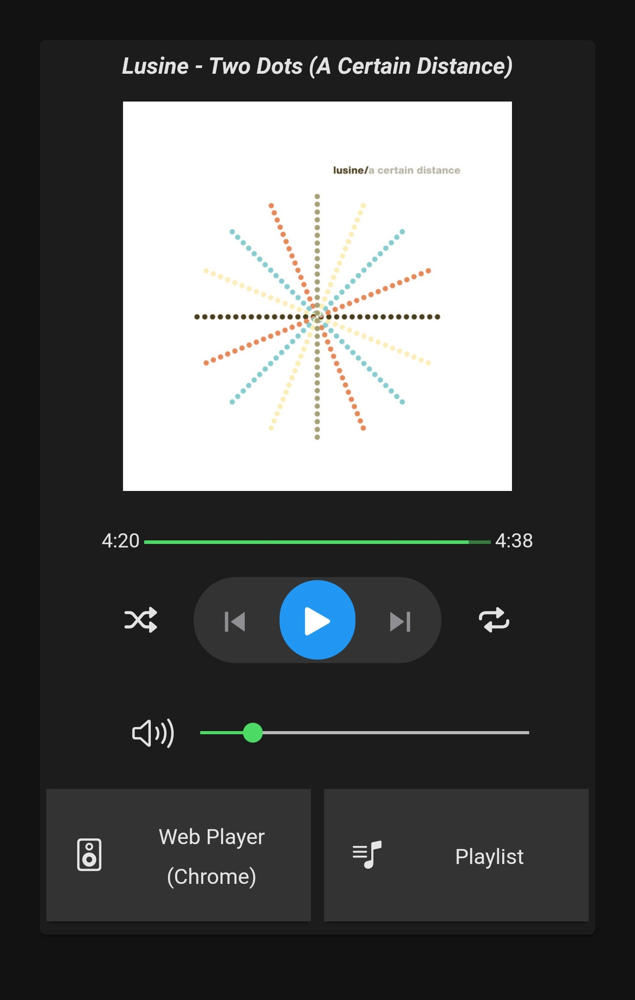

## Howto

In OpenHab 3.0

#### Create the thing and needed items
 * Install the OpenHab Spotify Binding
 * For each user configure a Spotify Player Bridge as a Thing
 * Add Items via UI: 
    * In your Model page choose 'Create Equipment from Thing' (for each user you have a thing, so you may need to do this more than once)
        * Select all defaults. Additonally thick 'Show Advanced' and include 'Track Progress (ms)' and 'Track Duration (ms)' 
 * Add items via code: 

```yaml
    String	spotifyTrackPlay            "Track Play"        {channel="spotify:player:<SpotifyPlayerBridge>:trackPlay"}
    
    String	spotifyActiveDeviceName     "Device name"       {channel="spotify:player:<SpotifyPlayerBridge>:deviceName"}
    Dimmer	spotifyActiveDeviceVolume   "Device volume"     {channel="spotify:player:<SpotifyPlayerBridge>:deviceVolume"}
    Switch	spotifyActiveDeviceShuffle  "Shuffle"           {channel="spotify:player:<SpotifyPlayerBridge>:deviceShuffle"}
    String	spotifyTrackRepeat          "Repeat"            {channel="spotify:player:<SpotifyPlayerBridge>:trackRepeat"}
    
    String	spotifyArtistName           "Artist"            {channel="spotify:player:<SpotifyPlayerBridge>:artistName"}
    
    String	spotifyTrackName            "Track Name"        {channel="spotify:player:<SpotifyPlayerBridge>:trackName"}
    String	spotifyTrackProgress        "Track progress"    {channel="spotify:player:<SpotifyPlayerBridge>:trackProgress"}
    String	spotifyTrackDuration        "Track duration"    {channel="spotify:player:<SpotifyPlayerBridge>:trackDuration"}
    Number	spotifyTrackProgressMs      "Track progress"    {channel="spotify:player:<SpotifyPlayerBridge>:trackProgressMs"}
    Number	spotifyTrackDurationMs      "Track duration"    {channel="spotify:player:<SpotifyPlayerBridge>:trackDurationMs"}
    
    String	spotifyAlbumName            "Album"             {channel="spotify:player:<SpotifyPlayerBridge>:albumName"}
    Image	spotifyAlbumImage           "Album Image"       {channel="spotify:player:<SpotifyPlayerBridge>:albumImage"}

    String	spotifyActiveDevices        "Device [%s]"       {channel="spotify:player:<SpotifyPlayerBridge>:devices"}
    String	spotifyPlaylists            "Playlist [%s]"     {channel="spotify:player:<SpotifyPlayerBridge>:playlists"}
```

#### Install the widget
 * Go to the 'Developers Tools'
 * Select 'Widgets' press the '+' icon.
 * Delete all text in the edit window
 * Paste all the code from [Spotify-Widget.yaml](https://github.com/Kolkman/OpenHab-Various/blob/main/OH3%20Widgets/Spotify%20Widget/Spotify-Widget.yaml) into the edit window
 * Safe the lot: Ctrl+s
 
 #### Use the widget
 * In your pages editor you can select the widget from your personal widgets
 * In its properties you have to select the Spotify items you created above.

#### Acknowledgement

The [Sonos Interface](https://community.openhab.org/t/sonos-player-widget-for-oh3-mainui/108327) got me going.


